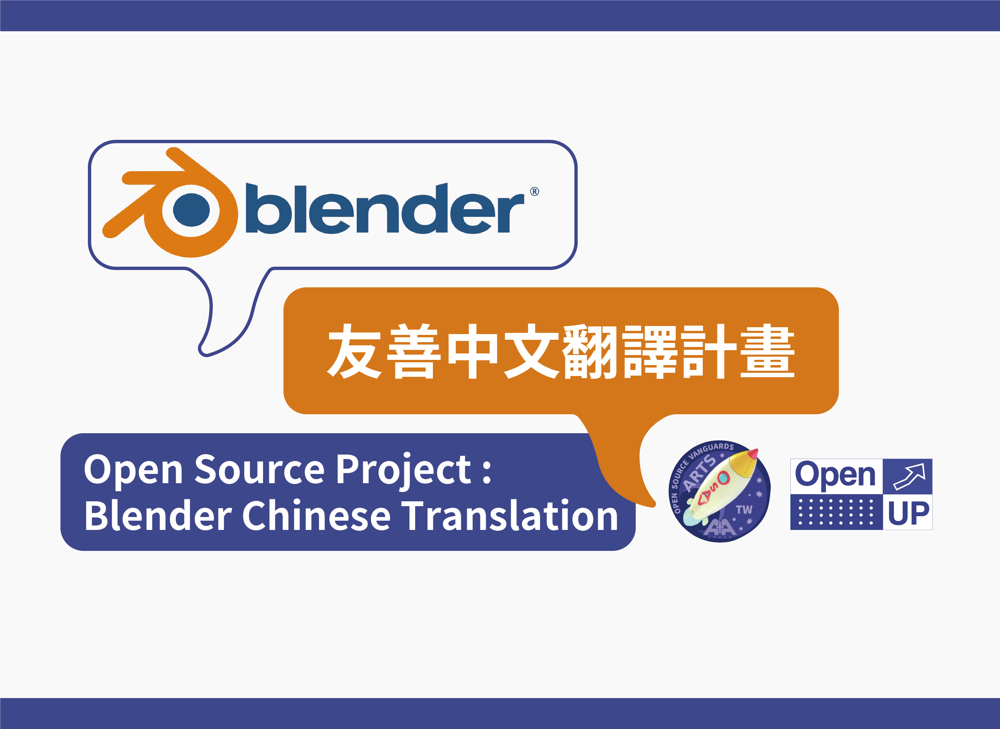

# Blender友善中文介面0.1版出爐啦！

檔案說明：

1. 中英雙語介面 blender.mo
2. 中文單語介面 /Monolingual/blender.mo

如何使用：

1. 按右上方綠色按鈕選 Download ZIP 下載壓縮檔
2. 解壓縮後將 blender.mo 取代下列路徑檔案...

   （Blender安裝位置/2.8?/datafiles/locale/zh_TW/LC_MESSAGES/blender.mo）

# Blender Chinese Translation Project
# Blender 友善中文翻譯計畫

**Introduction / 專案介紹**: 

This year, we’d like to invite all of you to join at least one open source project as your new year’s resolution. ✨Blender Chinese Translation Project✨ Blender is an open source 3D software. Open UP Summit will collaborate with A+A Space to start the translation project from mid of February to mid of April! Let’s sign up on Open UP Global and join this project!

Open UP Global 和 A+A Space 共同合作發起 Blender 友善中文翻譯計畫，Blender 是一款 3D 開源軟體，其軟體成熟度不亞於付費軟體，在操作介面上卻遲遲未能有全面的中文化介面而造成使用者入門門檻無法降低，亦未能在學校被持續推廣。因此，我們將在今年(2020)二月中旬到四月中旬在A+A Space (近捷運南京三民站) 定期在每週四晚上七點舉辦友善中文翻譯貢獻，只要你能夠週四晚上來為 Blender 貢獻英翻中的能力，前往官網加入專案，我們將會盡快聯繫你！

**Time / 實體聚會時間**: 

From 20th February to 16th April. Every Thursday Night 19:00-21:00.

二月二十日到四月十六日，每週四晚上七點到九點。

**Location / 地點**: 

[A+A Space 共創共享空間](https://goo.gl/maps/Qs5z8ZT974N4SEiu6)
(3/15之前在三創11樓)

**RSVP Link**: https://www.openup.global/projects/74fd1830-8483-434f-8fa7-f35dbae9c48f

---

## Using the translation on your Blender / 將自己的 Blender 介面中文化

[**Video / 影片教學**](https://www.youtube.com/watch?v=GOch_jZKPQU&feature=youtu.be)

### MacOS
1. Download and install [Blender](https://www.blender.org/download/)
   
   下載並安裝 Blender
1. Move Blender into Application folder
   
   將 Blender 移到「應用程式」
1. Right-click on the Blender file and select "Show Package Contents"

   對 Blender 按右鍵並選擇「顯示套件內容」
1. Go to "⁨Contents⁩ ▸ ⁨Resources⁩ ▸ ⁨2.81⁩ ▸ ⁨datafiles⁩ ▸ ⁨locale⁩ ▸ ⁨zh_TW⁩ ▸ ⁨LC_MESSAGES⁩", and find "blender.mo"
   
   依照路徑「⁨Contents⁩ ▸ ⁨Resources⁩ ▸ ⁨2.81⁩ ▸ ⁨datafiles⁩ ▸ ⁨locale⁩ ▸ ⁨zh_TW⁩ ▸ ⁨LC_MESSAGES⁩」找到繁體中文翻譯檔案「blender.mo」
1. Once you tanslated "zh_TW.po" and export a "blender.mo" file, you can replace the "blender.mo".
   
   當翻譯完成後，只要輸出成「blender.mo」，即可覆蓋原有的 blender.mo，Blender 將呈現更新後的翻譯

### Windows
1. Download and install [Blender](https://www.blender.org/download/)
   
   下載並安裝 Blender
1. Go to "⁨C:\Program Files\Blender Foundation\Blender\2.80\datafiles\locale\zh_TW\LC_MESSAGES", and find "blender.mo"
   
   依照路徑「⁨C:\Program Files\Blender Foundation\Blender\2.80\datafiles\locale\zh_TW\LC_MESSAGES」找到繁體中文翻譯檔案「blender.mo」
1. Once you tanslated "zh_TW.po" and export a "blender.mo" file, you can replace the "blender.mo".
   
   當翻譯完成後，只要輸出成「blender.mo」，即可覆蓋原有的 blender.mo，Blender 將呈現更新後的翻譯

---
## How to start / 如何開始翻譯

Before starting to translate the zh_TW.po, you can download the blender.mo to check to latest translation version. Thanks to contributors, they have translated 80% of words and sentences. Based on their contribution, we have checked it as correct and updated it. Once you update the translation file, you can open your Blender and see the latest translation version.

感謝過往翻譯貢獻者，讓我們能夠在一定基礎上進行翻譯專案。在翻譯開始之前，請先下載本專案的 blender.mo 並將該檔案按照上面的步驟覆蓋原本 Blender 的 blender.mo 檔來更新繁體中文翻譯。覆蓋原檔案後，再次打開 Blender 即可看到更新後的翻譯。

We use a tool called [Poedit](https://poedit.net/), an editer to edit .po file.

我們使用一個工具叫 [Poedit](https://poedit.net/)，它可以讓我們編輯 .po 檔，並且輸出成 .mo 檔讓程式可以讀取翻譯的字詞。

After the translation you did, welcome to pull request your translation to this project!

完成一個階段翻譯後，歡迎發 PR 給我們!

不知道怎麼發 PR(Pull Request) 嗎，來看[發 PR 教學](https://gitbook.tw/chapters/github/pull-request.html)，一起為專案貢獻吧！

### Notice ... / 需要注意...
- The translation principle must meet the following four points:
   1. Understand the purpose of this function before translation, mainly functional translation, not text translation
   2. User friendly (easy to understand, so that people who do not understand English and 3D can use blender)
   3. All Chinese (all English to Chinese, so we should not discuss which should not be translated into Chinese)
   4. Translate the most commonly used interface first, don't go through some rarely used interface
   
  翻譯原則必須符合以下四點：
  1. 在翻譯前先了解該功能的用途，以功能翻譯為主，不是以文字翻譯為主
  2. 對使用者友善（淺顯易懂，讓不懂英文與3D的人可以使用blender)
  3. 全中文化（全部英文轉中文，所以不討論哪些不該翻成中文）
  4. 以使用者最常用到的界面優先翻譯，不要去翻一些很少用到的界面
- Some words will not be translated.
  
  部分介面文字無法被翻譯，如 layout, modeling,...等等位於 Workspace 的名詞。
- If you have any question about the translation, go to [**Issues**](https://github.com/openupglobal/Blender-Chinese-Translation-Project/issues) to find any related issue or submit a new issue.
  
  對翻譯有任何問題，請前往 [**Issues**](https://github.com/openupglobal/Blender-Chinese-Translation-Project/issues) 尋找相關的 issue 或開一個新的 issue。
